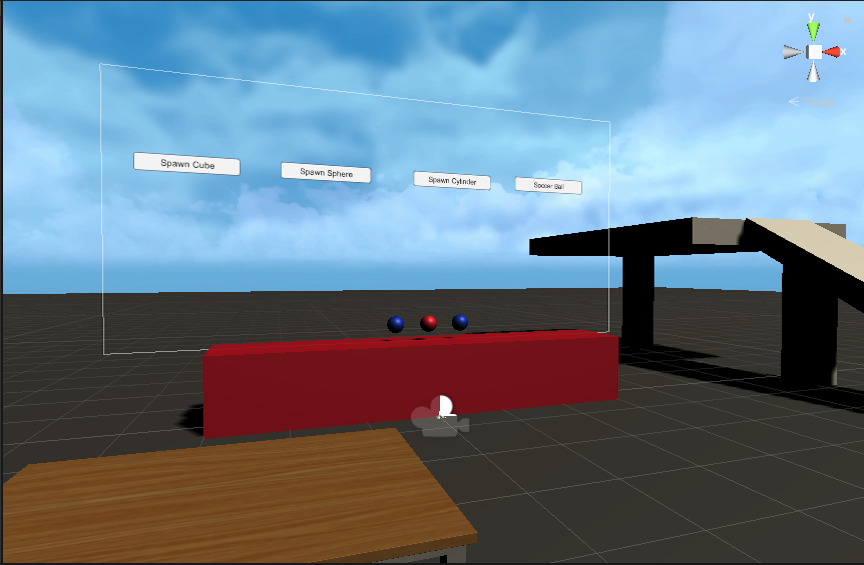

# VR-Sandbox-Playground
First attempt at Unity and VR. This game is intended to be a playground where the player is able to create a world of their choosing by spawning in various objects and interactables, there is no goal or winning. The game is simply intended to spend time creating whatever the heart and mind desire.
Currently the game is playable but rather empty, consisting of no more than a set of unanimated hands that are capable of picking up various items in the game world. The player is also capable of moving the joystick and selecting a few objects to spawn in using the floating menu above the red platform.
## What I plan to add next
- More game objects to spawn in
- The ability to create platforms and roam more freely to place them as desired.
- The ability to rotate and alter the color of platforms before they are placed.
- The ability to delete any and all objects and platforms.
- A grapple gun to allow for a player to swing or climb.
- Physics objects that break as a result of enough force being applied.
- A dummy that can be interacted with.
- A more complex terrrain and set of textures to help the look of the game world.
- The ability to save the current world state.

If you are interested in playing the game I do not currently have it available anywhere on the internet, but if you send me a message or email I can send you the apk file to place on your VR headset.
## Special Thanks
Special thanks to Valem (https://www.youtube.com/channel/UCPJlesN59MzHPPCp0Lg8sLw) and this Medium article(https://medium.com/@sofaracing/how-to-develop-for-oculus-quest-on-macos-with-unity-5aa487b80d13) for a comprehensive guide to getting started with VR development in Unity.
## Tech used
- Oculus Quest (in developer mode)
- Sidequest to download the APK files onto my quest
- Unity with C#

